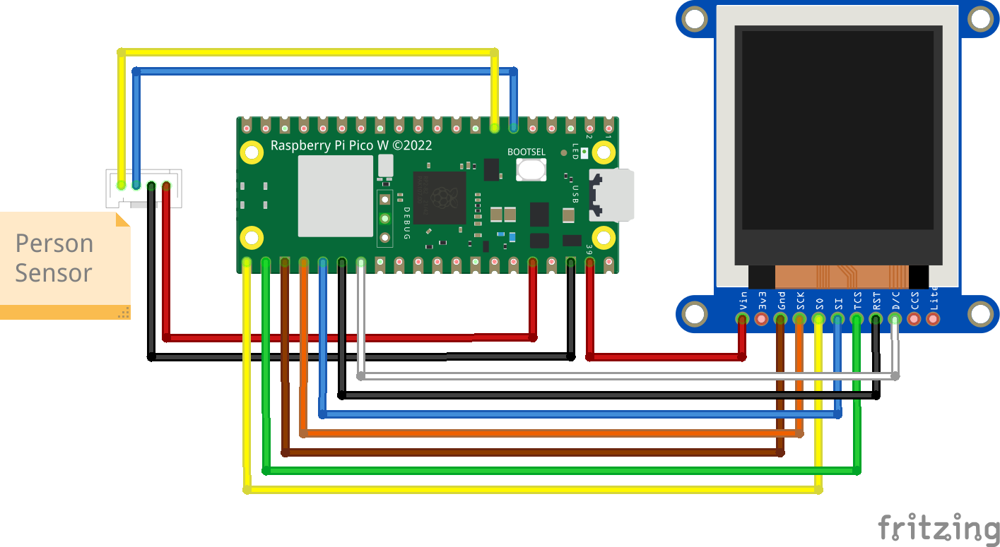
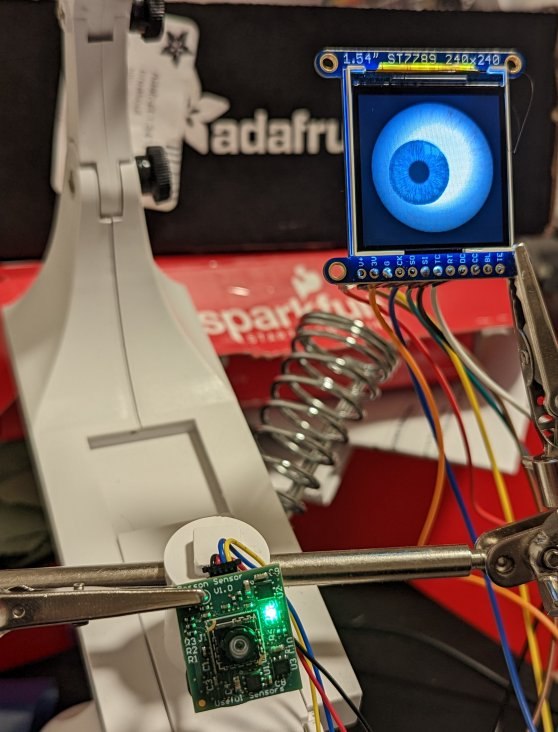

# Spooky Face-Following Eyeball
Face-Following Eyeball using a Raspberry Pi Pico, a Person Sensor, and an ST7789 display, controlled using CircuitPython.
Based on original code by @todbot / Tod Kurt, at [github.com/todbot/circuitpython-tricks/blob/main/larger-tricks/eyeballs/](https://github.com/todbot/circuitpython-tricks/blob/main/larger-tricks/eyeballs/).

## Introduction

The [Person Sensor](https://usfl.ink/ps) from [Useful Sensors](https://usefulsensors.com)
is a small, low-cost hardware module that detects nearby peoples’ faces, and
returns information about how many there are, where they are relative to the
device, and performs facial recognition. It is designed to be used as an input
to a larger system, and this example shows how to use it to a small display that
draws an eyeball that follows the nearest face.

## BoM

To build this project you'll need:

 - [Raspberry Pi Pico H](https://www.adafruit.com/product/5056).
 - [Person Sensor from Useful Sensors](https://usfl.ink/ps).
 - [Qwiic connector cable with female jumpers](https://www.sparkfun.com/products/17261).
 - [8 Female to female jumper wires](https://www.sparkfun.com/products/9385).
 - [Adafruit 1.54" 240x240 TFT LCD Display](https://www.adafruit.com/product/3787)

The only soldering needed is to attach the headers to the LCD display. You
should be able to use other displays supported by CircuitPython, but you'll need
to figure out the pins. Other ST7789-based displays will be easiest. You can
also use a regular Pico and solder on the headers yourself if you don't have a
Pico H.

## Assembling

### LCD Display

 - Solder on the header to the display.
 - Wire the display pins to the corresponding Pico pins.

| Pico Pin | Display Pin |
| -------- | ----------- |
| Pin 21 (GP16, SPI0RX) (Yellow) | MISO> / SO |
| Pin 22 (GP17, SPI0CSn) (Green) | TFTCS / TC |
| Pin 23 (GND) (Brown) | Gnd / G |
| Pin 24 (GP18, SPI0SCK) (Orange) | SCK< / CK |
| Pin 25 (GP19. SPI0TX) (Blue) | MOSI< / SI |
| Pin 26 (GP20) (Black) | RST / RT |
| Pin 27 (GP21) (White) | DC / DC |
| Pin 39 (VSYS) (Red) | Vin / V+ |

The colors are those used on the wiring diagram below. There are two different
abbreviations for pins on the display, on the front and the back of the board,
so I've included both in the description.

### Person Sensor

Wiring up the sensor requires 4 jumpers, to connect VDD, GND, SDA and SCL. We're
using I2C port 0, which on the Pico is assigned to GPIO4 (SDA, pin 6) and GPIO5
(SCL, pin 7) in software. Power is supplied from 3V3(OUT) (pin 36), with ground
attached to GND (pin 38). If you're using [Qwiic connectors](https://www.sparkfun.com/qwiic),
the colors  will be black for GND, red for 3.3V, blue for SDA, and yellow for
SDC. It's the same setup as the [introductory CircuitPython sample code](https://github.com/usefulsensors/person_sensor_circuit_python).

### Wiring

### Mounting

You'll need the display and sensor both facing in the same direction, with the
I2C connector of the sensor at the top, and the display's pins at the bottom,
so they're in the right orientation.

## Setting up Circuit Python

You should read the [official guide to setting up CircuitPython on a Pico](https://learn.adafruit.com/getting-started-with-raspberry-pi-pico-circuitpython)
for the latest information, but here is a summary:

 - Download CircuitPython for your board from circuitpython.org. The Pico
 version is available at https://circuitpython.org/board/raspberry_pi_pico/.
 This project has been tested using the `8.0.0-beta.2` version.
 - Hold down the `bootsel` button on the Pico and plug it into a USB port.
 - Drag the CircuitPython uf2 file onto the `RPI-RP2` drive that appears.

Once you've followed those steps, you should see a new `CIRCUITPY` drive appear.
You can now drag `code.py` files onto that drive and the Pico should run them.

## Install Libraries

We need the [adafruit_imageload](https://docs.circuitpython.org/projects/imageload/en/latest/)
and [adafruit_st7789](https://docs.circuitpython.org/projects/st7789/en/latest/)
libraries to draw the eyeball, so the first step is to download a big bundle of
all the CircuitPython libraries from [circuitpython.org/libraries](https://circuitpython.org/libraries).
You'll need to find the right bundle for your CircuitPython version.

Once you have that downloaded, unpack the bundle on your local machine. In the
file viewer, go to the `lib` folder within the unpacked bundle and copy the
`adafruit_imageload` directory and the `adafruit_st7789.mpy` file into the `lib`
folder on the `CIRCUITPYTHON` drive.

## Install the Code

Now your eyeball is set up, copy the `code.py`, `eye0_ball2.bmp`, and 
`eye0_iris0.bmp` files from this repository into the `CIRCUITPYTHON` drive. You
should notice that the green LED on the Person Sensor lights up when it sees
your face, and see an eyeball that moves as you move you face within view of the
sensor.

## Next Steps

There's probably enough SPI pins to run two eyeballs from the Pico, if you want a
pair?